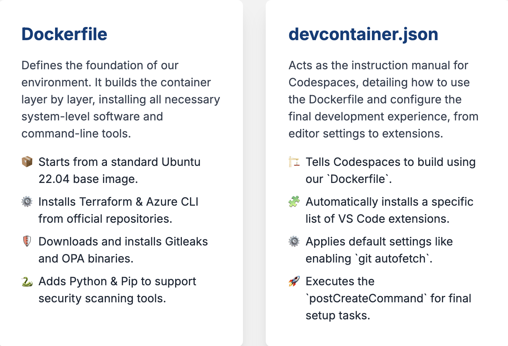
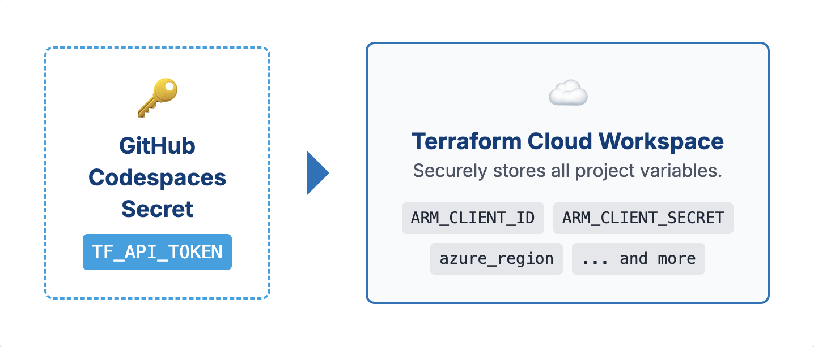
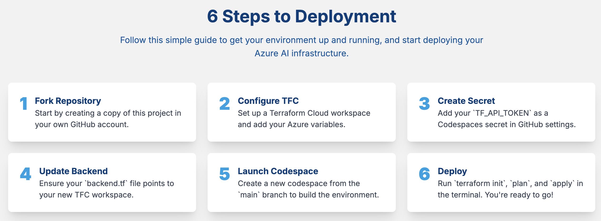

# Custom Development Environment for Azure AI & Terraform

This repository is configured with a custom GitHub Codespaces environment designed for securely deploying Azure AI services using Terraform. It comes pre-loaded with a suite of tools for infrastructure as code, security scanning, and policy enforcement.

## Overview

The goal of this project is to provide a standardized, ready-to-use development environment that eliminates setup friction and embeds security best practices from the start. When you launch this repository in GitHub Codespaces, you get a fully configured container with all the necessary CLIs, extensions, and authentication mechanisms needed for a robust Azure workflow.

---

## Key Features

This Codespaces image includes:

**Command-Line Tools:**
* **Terraform:** For defining and managing infrastructure as code.
* **Azure CLI (`az`):** For interacting with the Microsoft Azure platform.
* **Checkov:** An IaC static analysis tool to find misconfigurations in Terraform code.
* **Gitleaks:** A secret scanning tool to prevent committing sensitive data.
* **Open Policy Agent (OPA):** A policy engine for enforcing custom rules on your configurations.
* **Node.js & Python:** Essential runtimes for supporting various tools and extensions.

**VS Code Extensions:**
* Official extensions for **Terraform**, **Azure**, **GitHub Actions**, and **Docker**.
* Security extensions for **Checkov**, **Gitleaks**, and **OPA**.
* AI development extensions like **Azure AI Foundry** and the **AI Toolkit**.

---

## Environment Configuration Deep Dive

The entire environment is defined within the `.devcontainer` directory via two files. Let's break down the key files.

### `Dockerfile`

This file defines the base image and installs all the system-level tools.

* **Base Image:** It starts from `mcr.microsoft.com/vscode/devcontainers/base:ubuntu-22.04`, which is a standard image from Microsoft that already includes many common development tools.
* **Tool Installation:**
    * It uses `apt-get` to install dependencies and add the official package repositories for **Terraform** (from HashiCorp) and the **Azure CLI** (from Microsoft). This is the most reliable way to install and update these tools.
    * **Gitleaks** and **Open Policy Agent (OPA)** are installed by downloading their latest binaries directly, making them immediately available on the command line.
    * `python3-pip` is installed to support the `checkov` package.

### `devcontainer.json`

This is the main configuration file that tells GitHub Codespaces how to build and configure the environment.

* **`build`:** Points to the `Dockerfile` to be used for building the image.
* **`features`:** This block uses the modern "Dev Container Features" to reliably install **Node.js**. This is preferred over installing it in the Dockerfile.
* **`settings`:** This section configures the VS Code editor itself. For example, `git.autofetch` is enabled to keep your repository information up-to-date automatically.
* **`extensions`:** This array lists all the VS Code extension IDs to be installed by default. This ensures every user has the same integrated tooling experience.
* **`postCreateCommand`:** This is a powerful command that runs *after* the container has been built but *before* the user connects. It's used here to:
    1.  Install `pnpm` and the `azure-functions-core-tools` using `npm`.
    2.  Install `checkov` using `pip3`.
    3.  **Crucially, it creates the Terraform CLI configuration file (`~/.terraform.d/credentials.tfrc.json`) and populates it with the `TF_API_TOKEN` environment variable.** This step automates the `terraform login` process.
---

## Variable Management Strategy

This environment is designed around a hybrid variable management strategy that balances security, collaboration, and flexibility.

### Terraform Cloud (Primary Method)

It is **highly recommended** that you use a Terraform Cloud workspace to manage the majority of your variables.

* **What to Store Here:** All your standard Terraform variables, including sensitive ones like `ARM_CLIENT_ID`, `ARM_CLIENT_SECRET`, `ARM_TENANT_ID`, and non-sensitive ones like `azure_region` or `project_name`.
* **Why:** Terraform Cloud provides a secure, centralized location for your variables, with a UI for easy management, access controls, and a history of changes.

### GitHub Codespaces Secret (`TF_API_TOKEN`)

There is **one special variable** that must be stored as a GitHub Codespaces secret: `TF_API_TOKEN`.

* **Purpose:** This token is **not** for an Azure service principal. It is the API token that allows the Terraform CLI *inside your Codespace* to authenticate with your Terraform Cloud account. Once authenticated, Terraform can then access all the other variables you stored in your workspace.

* **How to Set It Up:**
    1.  In your GitHub repository, navigate to **`Settings` > `Secrets and variables` > `Codespaces`**.
    2.  Click **`New repository secret`**.
    3.  For the name, enter exactly `TF_API_TOKEN`.
    4.  For the value, paste an API token you have generated from your [Terraform Cloud account](https://app.terraform.io/app/settings/tokens?source=terraform-login). 
    5.  The `remoteEnv` block in the `devcontainer.json` file ensures this secret is injected into the environment, and the `postCreateCommand` uses it to configure Terraform automatically.

### Flexibility: Using Other Backends

While this environment is optimized for Terraform Cloud, you are free to use any backend you choose. If you prefer to use Azure Storage for your state files, you can simply:
1.  Update your `backend.tf` file to use the `azurerm` backend.
2.  Manage your secrets (like service principal credentials) using a different method, such as GitHub Actions secrets for CI/CD pipelines.

---

## Getting Started: A Step-by-Step Guide


1.  **Fork this Repository:** Start by forking this repository to your own GitHub account.
2.  **Configure Terraform Cloud:**
    * Log in to your Terraform Cloud account and create a new workspace.
    * In the workspace settings, go to the "Variables" section and add all the necessary variables for your Azure deployment (e.g., `ARM_CLIENT_ID`, `ARM_CLIENT_SECRET`, etc.).
3.  **Create the GitHub Secret:**
    * In your forked repository, go to **`Settings` > `Secrets and variables` > `Codespaces`**.
    * Create the **`TF_API_TOKEN`** secret with a valid token from Terraform Cloud.
4.  **Update Backend Configuration:**
    * Open the `backend.tf` file (or equivalent) in the repository.
    * Ensure the `organization` and `workspaces.name` values in the `cloud` block match your Terraform Cloud setup.
5.  **Launch Codespaces:**
    * Click the **`< > Code`** button on your repository page.
    * Select the **`Codespaces`** tab and click **`Create codespace on main`**.
    * Wait for the environment to build.
6.  **Deploy Your Infrastructure:**
    * Once the Codespace is running, a terminal will be available.
    * You are already authenticated with Terraform Cloud. You can now run your standard commands:
        ```bash
        terraform init
        terraform plan
        terraform apply
        ```
